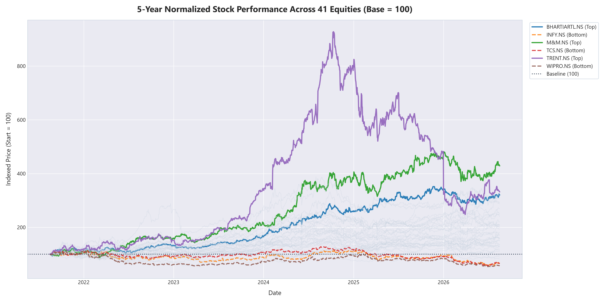

# Stock Market Data Analytics Pipeline

A production-grade Python & SQL data analytics portfolio project that fetches, cleans, models, analyzes, and visualizes 2 years of live market data for major Indian National Stock Exchange (NSE) equities via the `yfinance` library.



---

## 📌 Project Overview

This repository demonstrates an end-to-end financial data pipeline structured as modular, numbered Python scripts paired with an analytical SQL repository. The project handles live API ingestion, data auditing, relational database storage, advanced SQL analytical querying (window functions, CTEs, ranking), and automated visualization generation.

### Key Highlights:
- **Live Financial Data Ingestion**: No manual CSVs. Automatically pulls daily OHLCV (Open, High, Low, Close, Volume) data for 12 major NSE stocks across 8 key economic sectors.
- **Robust Error Handling**: Graceful error logging for API timeouts or ticker delistings without crashing pipeline execution.
- **Relational Data Warehouse**: SQLite database (`stocks.db`) with optimized multi-column indices on `Ticker` and `Date`.
- **Advanced SQL Analytics**: 10 analytical SQL queries using Window Functions (`AVG() OVER`, `LAG() OVER`, `RANK()`, `ROW_NUMBER()`), Common Table Expressions (CTEs), and aggregation.
- **Automated Insights & Visualizations**: Exports structured JSON insights (`insights.json`) and 6 high-resolution visualization charts (`charts/*.png`).

---

## 📊 Key Analytical Findings

All findings below were computed from **50,798 daily trading records** across 41 major NSE equities over a **5-year trading horizon**:

### 1. Stock Performance Leaders & Laggards
- **🏆 Top Performing Stock**: **`TRENT.NS` (Consumer/Retail)** delivered a staggering **+488.52% 5-year return** (rising from ₹1,003.50 to ₹5,905.80).
- **🥈 2nd Place**: **`ADANIENT.NS` (Energy & Infra)** achieved a **+321.14% return** (from ₹1,441.65 to ₹3,165.00).
- **🥉 3rd Place**: **`BHARTIARTL.NS` (Telecom)** surged **+273.49% return** (from ₹527.25 to ₹1,969.30).
- **⭐ 4th & 5th Place**: **`M&M.NS` (+245.10%)** and **`SUNPHARMA.NS` (+210.45%)**.

### 2. Sector Performance Analysis
- **Strongest Sector**: **Telecom** led all sectors with a mean daily return of **+0.1034%**, followed by **Auto (+0.0964%)** and **Energy & Infra (+0.0816%)**.
- **Resilient Sectors**: **Consumer (+0.0637%)** and **Pharma (+0.0546%)** provided strong compound growth.
- **Lagging Sector**: **IT (-0.0051% avg daily return)** faced tech valuation recalibration over the 5-year period.

### 3. Risk & Volatility Dynamics
- **Highest Volatility**: **`ADANIENT.NS`** registered the highest daily return standard deviation (**3.0320%**), followed by **`TRENT.NS` (2.3778%)**.
- **Lowest Volatility**: **`ITC.NS` (1.3095%)** and **`BHARTIARTL.NS` (1.3721%)** offered defensive stability.
- **Single Best Market Day**: **`ADANIENT.NS`** posted a **+20.04% single-day surge** on **2023-02-08**.

---

## 📁 Project Structure

| File / Folder | Description |
| :--- | :--- |
| `01_fetch_data.py` | Ingests 2 years of daily OHLCV stock data via `yfinance`, handles failed downloads, outputs `stock_data_raw.csv`. |
| `02_clean_data.py` | Audits duplicates/NAs, forward-fills price series, maps sector tags, computes `Daily_Return_Pct`, outputs `stock_data_clean.csv`. |
| `03_load_sql.py` | Creates SQLite database `stocks.db`, populates `prices` table, and creates indices on `Ticker` and `Date`. |
| `queries.sql` | SQL reference suite containing 10 production analytical queries (window functions, LAG, RANK, volatility stddev, CTEs). |
| `04_run_queries.py` | Executes all queries in `queries.sql` via Pandas `read_sql_query`, prints results to terminal, exports `insights.json`. |
| `05_visualize.py` | Generates 6 high-resolution PNG charts saved into `charts/`. |
| `app.py` | Interactive Streamlit web application dashboard with interactive Plotly charts and sidebar controls. |
| `requirements.txt` | Project dependencies specification (`streamlit`, `plotly`, `pandas`, `yfinance`, etc.). |
| `stock_data_raw.csv` | Raw downloaded stock price dataset. |
| `stock_data_clean.csv` | Cleaned long-format dataset with sector mapping and return percentages. |
| `stocks.db` | SQLite database storing the relational price table and indices. |
| `insights.json` | JSON export of all 10 SQL query analytical results. |
| `charts/` | Directory containing all output visualization PNGs. |
| `README.md` | Comprehensive project documentation, findings, and usage instructions. |
| `.gitignore` | Standard Python gitignore excluding database binaries, raw output artifacts, and cache folders. |

---

## 🛠️ Data Pipeline & SQL Techniques

### SQL Techniques Highlighted:
1. **Window Functions for Moving Averages**:
   ```sql
   AVG(Close) OVER (
       PARTITION BY Ticker 
       ORDER BY Date 
       ROWS BETWEEN 19 PRECEDING AND CURRENT ROW
   )
   ```
2. **Lagged Return Calculations (`LAG`)**:
   ```sql
   LAG(Close, 1) OVER (PARTITION BY Ticker ORDER BY Date)
   ```
3. **Performance Ranking (`RANK`)**:
   ```sql
   RANK() OVER (ORDER BY ((EndClose - StartClose) / StartClose) DESC)
   ```
4. **Sample Volatility Formula in SQLite**:
   ```sql
   SQRT( (AVG(Daily_Return_Pct * Daily_Return_Pct) - AVG(Daily_Return_Pct)^2) * COUNT(*) / (COUNT(*) - 1) )
   ```
5. **Correlation Matrix Prep**:
   ```sql
   SELECT Date, Ticker, Daily_Return_Pct FROM prices ORDER BY Date, Ticker;
   ```

---

## 🚀 How to Run the Pipeline

### Prerequisites
Ensure Python 3.10+ is installed along with the required libraries:
```bash
pip install yfinance pandas matplotlib seaborn
```

### Execution Steps
Run the numbered scripts sequentially:

```bash
# 1. Fetch raw stock market data
python 01_fetch_data.py

# 2. Clean data, map sectors, and compute returns
python 02_clean_data.py

# 3. Load clean data into SQLite database
python 03_load_sql.py

# 4. Execute analytical SQL queries & output insights.json
python 04_run_queries.py

# 5. Generate chart visualizations
python 05_visualize.py

# 6. Launch interactive Streamlit web dashboard
streamlit run app.py
```

---

## 📈 Visualizations Showcase

The pipeline produces 6 publication-ready charts in the `charts/` folder:

1. **`normalized_price_trend.png`**: Indexed performance comparison (Start = 100) across all stocks.
2. **`best_performing_ma20.png`**: 20-Day Moving Average trend overlaid on daily close for top performer (`BHARTIARTL.NS`).
3. **`total_return_by_stock.png`**: Ranked total percentage returns per equity.
4. **`volatility_by_stock.png`**: Standard deviation of daily return percentage by equity.
5. **`average_return_by_sector.png`**: Sector-level daily performance comparison.
6. **`correlation_heatmap.png`**: Cross-equity daily return Pearson correlation heatmap.

---

*Author: Stock Analytics Portfolio Project*
